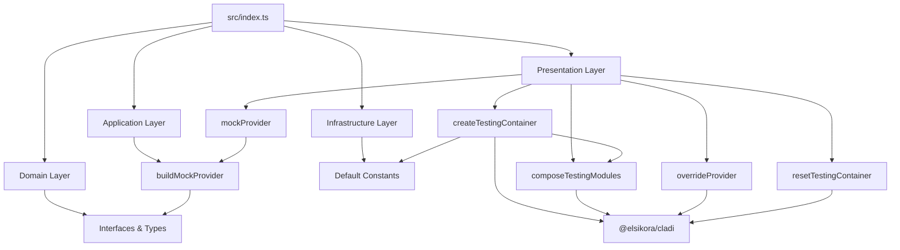

<a id="top"></a>

<p align="center">
  
</p>

<h1 align="center">🧪 ClaDI-Testing</h1>
<p align="center"><em>Testing-first utilities for ClaDI applications — explicit, composable, and boilerplate-free test containers with clean architecture.</em></p>

<p align="center">
    <a aria-label="ElsiKora logo" href="https://elsikora.com">
  
</a>         
</p>

## 💡 Highlights

- 🎯 Zero-boilerplate test containers — create, compose, and dispose DI containers in a single line with full type safety
- 🔄 In-place provider overrides — swap any dependency mid-test without rebuilding the entire container graph
- 🏗️ Clean architecture from the ground up — mirrors ClaDI's own domain/application/infrastructure/presentation layers
- 🧹 Leak-free by design — deterministic disposal of scopes and resources prevents test pollution across suites

## 📚 Table of Contents
- [Description](#-description)
- [Tech Stack](#-tech-stack)
- [Features](#-features)
- [Architecture](#-architecture)
- [Project Structure](#-project-structure)
- [Prerequisites](#-prerequisites)
- [Installation](#-installation)
- [Usage](#-usage)
- [Roadmap](#-roadmap)
- [FAQ](#-faq)
- [License](#-license)
- [Acknowledgments](#-acknowledgments)

## 📖 Description
**ClaDI-Testing** is a dedicated testing companion for [`@elsikora/cladi`](https://www.npmjs.com/package/@elsikora/cladi), the clean-architecture dependency injection framework for TypeScript. It eliminates the friction of wiring up DI containers in test suites by providing a purpose-built toolkit for creating, composing, mocking, overriding, and disposing test containers.

Whether you're writing unit tests for an isolated service, integration tests across module boundaries, or end-to-end tests for your entire composition root, ClaDI-Testing ensures your test setup remains **explicit**, **deterministic**, and **leak-free**.

### Real-World Use Cases

- **Microservice Testing**: Spin up isolated test containers per service boundary, mock external dependencies (databases, APIs, clocks), and tear them down cleanly between test cases.
- **Domain-Driven Design**: Test aggregate roots and domain services in isolation by overriding repository implementations with in-memory doubles.
- **CI/CD Pipelines**: Achieve deterministic test runs with no shared state — every test gets its own scoped container that is fully disposed after execution.
- **Library Authors**: If you publish modules built on ClaDI, provide consumers with test-friendly module compositions out of the box.

The library follows the same clean architecture boundaries as ClaDI itself — `domain` for contracts, `application` for provider-building logic, `infrastructure` for defaults, and `presentation` for the public API surface — making it a natural extension of the ClaDI ecosystem.

## 🛠️ Tech Stack

| Category | Technologies |
|----------|-------------|
| **Language** | TypeScript |
| **Runtime** | Node.js >= 20 |
| **Build Tool** | Rollup, TypeScript Compiler |
| **Testing** | Vitest, V8 Coverage |
| **Linting** | ESLint, Prettier |
| **Package Manager** | npm |
| **CI/CD** | Semantic Release, Husky, Commitlint, Commitizen |

## 🚀 Features
- ✨ ****`createTestingContainer()`** — Instantly create a preconfigured ClaDI container scoped for tests with modules, providers, validation, and locking options**
- ✨ ****`mockProvider()`** — Build type-safe mock providers using value or factory strategies with full dependency and lifecycle support**
- ✨ ****`overrideProvider()`** — Hot-swap any registered provider in-place without rebuilding the container, with metadata about whether the token was previously registered**
- ✨ ****`composeTestingModules()`** — Compose both plain `IDIModule` definitions and decorator-based module classes into a single test container**
- ✨ ****`resetTestingContainer()`** — Safely dispose the container and all tracked scopes/resources to prevent cross-test pollution**
- ✨ ****Dual module output** — Ships both ESM and CJS builds with full TypeScript declarations and source maps**
- ✨ ****Structured error diagnostics** — Throws `BaseError` instances with machine-readable codes (`MOCK_PROVIDER_FACTORY_INVALID`, `MOCK_PROVIDER_DEPS_NOT_ALLOWED`) for clear debugging**
- ✨ ****Zero runtime dependencies** — Only requires `@elsikora/cladi` as a peer dependency, keeping your test bundle lean**

## 🏗 Architecture

### System Architecture



### Data Flow

```mermaid
sequenceDiagram
    participant Test as Test Suite
    participant Create as createTestingContainer
    participant Compose as composeTestingModules
    participant Mock as mockProvider
    participant Build as buildMockProvider
    participant Container as ClaDI Container
    participant Override as overrideProvider
    participant Reset as resetTestingContainer

    Test->>Create: options with modules and providers
    Create->>Container: createDIContainer with scope
    Create->>Compose: compose modules into container
    Compose->>Container: composeDecoratedModules
    Test->>Mock: token + value/factory
    Mock->>Build: delegate to buildMockProvider
    Build-->>Mock: Provider definition
    Create->>Container: register providers
    Create->>Container: validate and/or lock
    Create-->>Test: configured container
    Test->>Container: resolve service
    Container-->>Test: resolved instance
    Test->>Override: container + new provider
    Override->>Container: unregister old token
    Override->>Container: register replacement
    Override-->>Test: wasRegistered result
    Test->>Reset: dispose container
    Reset->>Container: dispose all scopes
    Reset-->>Test: cleanup complete
```

## 📁 Project Structure

<details>
<summary>Click to expand</summary>

```
ClaDI-Testing/
├── docs/
│   ├── api-reference.md
│   └── testing-recipes.md
├── examples/
│   ├── 01-basic-testing/
│   │   └── main.ts
│   ├── 02-module-overrides/
│   │   └── main.ts
│   ├── README.md
│   └── tsconfig.json
├── src/
│   ├── application/
│   │   ├── utility/
│   │   └── index.ts
│   ├── domain/
│   │   ├── interface/
│   │   ├── type/
│   │   └── index.ts
│   ├── infrastructure/
│   │   ├── constant/
│   │   └── index.ts
│   ├── presentation/
│   │   ├── utility/
│   │   └── index.ts
│   └── index.ts
├── test/
│   ├── e2e/
│   │   └── testing-module.e2e.test.ts
│   └── unit/
│       ├── application/
│       ├── infrastructure/
│       └── presentation/
├── commitlint.config.js
├── eslint.config.js
├── LICENSE
├── lint-staged.config.js
├── package-lock.json
├── package.json
├── prettier.config.js
├── README.md
├── release.config.js
├── rollup.config.js
├── rollup.test.config.js
├── tsconfig.build.json
├── tsconfig.json
├── vitest.e2e.config.js
└── vitest.unit.config.js
```

</details>

## 📋 Prerequisites

- Node.js >= 20.0.0
- npm >= 9.0.0 (or compatible package manager)
- @elsikora/cladi >= 2.1.0 (peer dependency)

## 🛠 Installation
```bash
# Install as a dev dependency alongside ClaDI
npm install -D @elsikora/cladi-testing @elsikora/cladi

# Or with yarn
yarn add -D @elsikora/cladi-testing @elsikora/cladi

# Or with pnpm
pnpm add -D @elsikora/cladi-testing @elsikora/cladi


> **Compatibility Note:** `@elsikora/cladi-testing` requires `@elsikora/cladi >= 2.1.0` as a peer dependency.
```

## 💡 Usage
### Basic Test Container Setup

Create a test container with mock providers and resolve services:

```typescript
import { createToken } from "@elsikora/cladi";
import {
  createTestingContainer,
  mockProvider,
  resetTestingContainer
} from "@elsikora/cladi-testing";

interface IClock {
  now(): number;
}

interface IGreetingService {
  message(): string;
}

const ClockToken = createToken<IClock>("Clock");
const GreetingServiceToken = createToken<IGreetingService>("GreetingService");

const container = createTestingContainer({
  providers: [
    // Mock the clock with a deterministic value
    mockProvider(ClockToken, {
      now: () => 1_700_000_000_000,
    }),
    // Wire the service using the mocked clock
    {
      deps: [ClockToken],
      provide: GreetingServiceToken,
      useFactory: (clock: IClock): IGreetingService => ({
        message: () => `hello-at-${clock.now()}`,
      }),
    },
  ],
  shouldValidateOnCreate: true,
});

console.log(container.resolve(GreetingServiceToken).message());
// => "hello-at-1700000000000"

await resetTestingContainer(container);
```

---

### Overriding Providers Per Test Case

Swap dependencies mid-test without rebuilding the container:

```typescript
import { createModule, createToken } from "@elsikora/cladi";
import {
  createTestingContainer,
  mockProvider,
  overrideProvider,
  resetTestingContainer
} from "@elsikora/cladi-testing";

interface IUserRepository {
  findNameById(id: string): string | undefined;
}

interface IUserService {
  readName(id: string): string;
}

const UserRepositoryToken = createToken<IUserRepository>("UserRepository");
const UserServiceToken = createToken<IUserService>("UserService");

const appModule = createModule({
  exports: [UserServiceToken],
  providers: [
    mockProvider(UserRepositoryToken, {
      findNameById: () => "Alice",
    }),
    {
      deps: [UserRepositoryToken],
      provide: UserServiceToken,
      useFactory: (repo: IUserRepository): IUserService => ({
        readName: (id) => repo.findNameById(id) ?? "unknown",
      }),
    },
  ],
});

const container = createTestingContainer({
  modules: [appModule],
  shouldValidateOnCreate: true,
});

console.log(container.resolve(UserServiceToken).readName("u1"));
// => "Alice"

// Override with a factory-based mock
await overrideProvider(
  container,
  mockProvider(
    UserRepositoryToken,
    (): IUserRepository => ({
      findNameById: () => "Bob",
    }),
    { strategy: "factory" },
  ),
);

console.log(container.resolve(UserServiceToken).readName("u1"));
// => "Bob"

await resetTestingContainer(container);
```

---

### Using with Vitest

```typescript
import { describe, expect, it, afterEach } from "vitest";
import { createToken } from "@elsikora/cladi";
import {
  createTestingContainer,
  mockProvider,
  resetTestingContainer
} from "@elsikora/cladi-testing";
import type { IDIContainer } from "@elsikora/cladi";

const ServiceToken = createToken<string>("Service");

describe("MyService", () => {
  let container: IDIContainer;

  afterEach(async () => {
    await resetTestingContainer(container);
  });

  it("resolves the mocked service", () => {
    container = createTestingContainer({
      providers: [mockProvider(ServiceToken, "test-value")],
    });

    expect(container.resolve(ServiceToken)).toBe("test-value");
  });
});
```

---

### Mock Provider Strategies

**Value strategy** (default) — provides a static mock object:

```typescript
mockProvider(TokenA, { method: () => "static" });
```

**Factory strategy** — provides a factory function with optional dependencies and lifecycle:

```typescript
import { EDependencyLifecycle } from "@elsikora/cladi";

mockProvider(
  TokenA,
  (configValue: string) => ({ method: () => `dynamic:${configValue}` }),
  {
    strategy: "factory",
    deps: [ConfigToken],
    lifecycle: EDependencyLifecycle.SINGLETON,
  },
);
```

---

### Container Options

```typescript
const container = createTestingContainer({
  // Forward options to ClaDI's createDIContainer
  containerOptions: { scopeName: "custom-scope" },
  // Compose modules (plain or decorated)
  modules: [appModule, DecoratedModule],
  // Register additional providers after module composition
  providers: [mockProvider(ExtraToken, "extra")],
  // Validate all dependency graphs on creation
  shouldValidateOnCreate: true,
  // Lock the container to prevent further registrations
  shouldLockOnCreate: false,
});
```

## 🛣 Roadmap

<details>
<summary>Click to expand</summary>

| Task / Feature | Status |
|---|---|
| Core testing container creation (`createTestingContainer`) | ✅ Done |
| Mock provider builder with value/factory strategies | ✅ Done |
| In-place provider override (`overrideProvider`) | ✅ Done |
| Container disposal and cleanup (`resetTestingContainer`) | ✅ Done |
| Module composition for plain and decorated modules | ✅ Done |
| Dual ESM/CJS build output | ✅ Done |
| Unit and E2E test suites with 80%+ coverage thresholds | ✅ Done |
| Structured error diagnostics with machine-readable codes | ✅ Done |
| Scoped container hierarchies for nested test contexts | 🚧 In Progress |
| Snapshot-based provider diffing for debugging overrides | 🚧 In Progress |
| Auto-mock generation from ClaDI token metadata | 🚧 In Progress |
| Vitest plugin for automatic container lifecycle management | 🚧 In Progress |

</details>

## ❓ FAQ

<details>
<summary>Click to expand</summary>

### ❓ Frequently Asked Questions

**Q: Do I need to install `@elsikora/cladi` separately?**

A: Yes. `@elsikora/cladi` is a **peer dependency** — you must install it alongside `@elsikora/cladi-testing`. This ensures version compatibility and avoids duplicate instances in your dependency tree.

```bash
npm install -D @elsikora/cladi-testing @elsikora/cladi
```

---

**Q: Can I use this with Jest instead of Vitest?**

A: Absolutely. ClaDI-Testing is test-runner agnostic — it provides utilities that return plain objects and promises. The examples use Vitest, but the API works identically with Jest, Mocha, or any other test framework.

---

**Q: What happens if I forget to call `resetTestingContainer()`?**

A: The container and its scoped resources will remain in memory until garbage collected. While this won't cause errors in a single test, it can lead to **test pollution** if containers share mutable state. Always dispose containers in `afterEach` or `finally` blocks.

---

**Q: What's the difference between value and factory mock strategies?**

A: **Value strategy** (`default`) wraps your mock object directly via `useValue` — ideal for simple stubs. **Factory strategy** uses `useFactory`, allowing you to declare dependencies (`deps`), set a lifecycle (`SINGLETON`, `TRANSIENT`), and use async factories. Use factory when your mock needs to depend on other tokens in the container.

---

**Q: Can I use decorated module classes with `composeTestingModules()`?**

A: Yes. `composeTestingModules()` accepts both plain `IDIModule` objects created via `createModule()` and classes decorated with ClaDI's `@Module()` decorator. It delegates to `composeDecoratedModules()` internally.

---

**Q: Is this library suitable for production use?**

A: No — this is a **dev dependency** designed exclusively for test environments. It should be installed with `-D` / `--save-dev` and never imported in production code.

</details>

## 🔒 License
This project is licensed under **MIT**.

## 🙏 Acknowledgments
- **[@elsikora/cladi](https://www.npmjs.com/package/@elsikora/cladi)** — The clean-architecture dependency injection framework that this testing library extends
- **[Vitest](https://vitest.dev/)** — The blazing-fast test runner used for both unit and E2E tests
- **[Rollup](https://rollupjs.org/)** — Module bundler powering the dual ESM/CJS build output
- **[Semantic Release](https://semantic-release.gitbook.io/)** — Automated versioning and package publishing
- Inspired by testing patterns from **NestJS Testing Module** and **Angular TestBed**, adapted for ClaDI's explicit composition philosophy

---

<p align="center">
  <a href="#top">Back to Top</a>
</p>